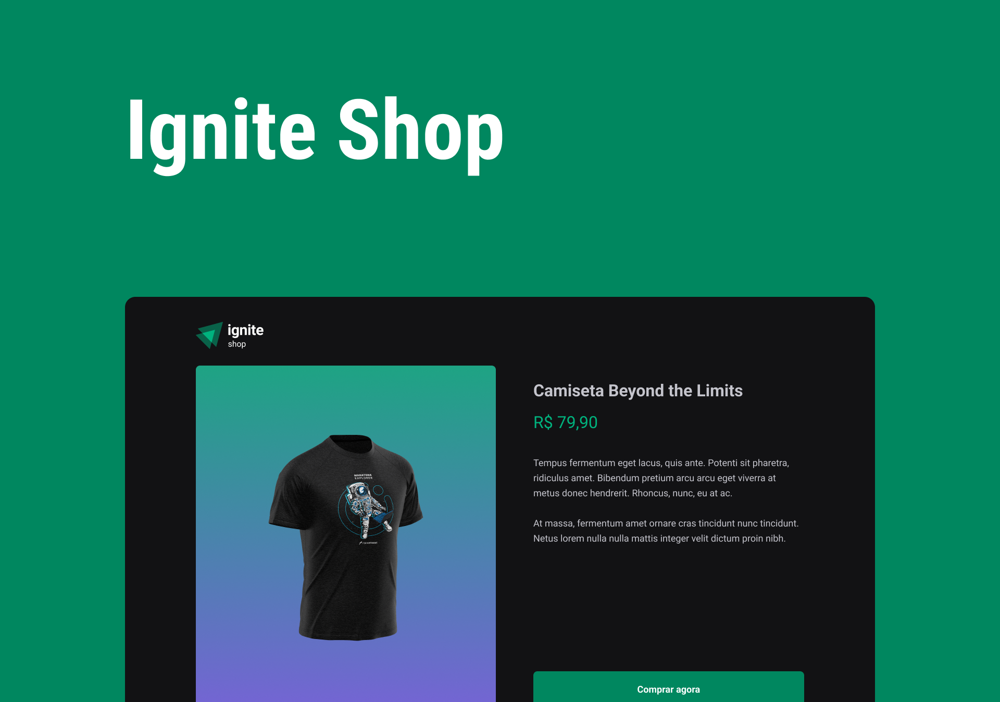

<h1 align="center">
  
</h1>

<h1 align="center">
  
</h1>

# Sobre o projeto

<p>
  Ignite Shop é mini e-commerce para venda de camisetas. Tem toda integração com o meio de pagamento do Stripe (test mode) que simula um pagamento real. Contém a listagem dos produtos, detalhes do produto e após o pagamento, a página de compra efetudada com sucesso.
</p>

# Tecnologias

- [NextJs](https://nextjs.org/)
- [Stitches](https://stitches.dev/)
- [TypeScript](https://www.typescriptlang.org/)
- [Keen-slider](https://keen-slider.io/)
- [Stripe](https://stripe.com/)
- [Eslint](https://eslint.org/)

## Como baixar o projeto

```bash
# Clonar o repositório
$ git clone https://github.com/wellingtonrodriguesbr/ignite-shop.git

# Entrar no diretório
$ cd ignite-shop


# Instalar as dependências
$ npm install

# Rodar o projeto
$ npm run dev
```

<br/>
<hr/>

<p align="center">Desenvolvido por <a href="https://www.linkedin.com/in/wellingtonrodriguesbr/" target="_blank">Wellington Rodrigues</a> ✌🏽</p>
